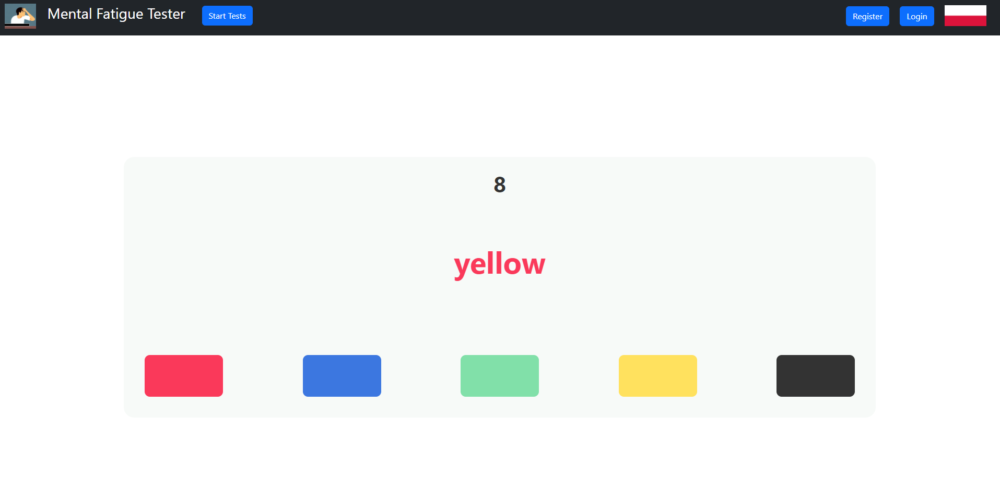

# Fatigue Tester Web Application
Fatigue Tester is a Django Web Application build as a part of our uniwersity course. 
It can be used to test one's mental fatigue, which can be especially meaningful after spending most of the day staring 
at the screen.
To achieve it, application will use standardized, fatigue-assesing tests based on the `Stroop Test`.

During the tests user is prompted to press buttons according to the displayed instructions, in the first part 
requiring to click on the button which color corresponds with the color of the text, in the second to click on the 
button of the color that describes the word. 

After that, based on the reaction speed and correctness their fatigue level is evaluated. 
Algorithm classifies the test's result and the precise performance data is plotted on the graph.
User can also fill the after-test survey, allowing to give the feedback about the test. 
Access to both tests and surveys results is possible (for the log-in users) through the Test Results button, which
bring the users to their database.

Application has an user system with two account types: `patient` and `supervisor`. 
The only difference between them is that supervisor can have other accounts as their patients, and as a result of this,
have the access to their tests results in order to monitor them. The process of setting up such relationship is done via
a simple invitation system.

## Conda environment
Conda environment with all packages required for the application to work is exported to the `conda_env.yml` file, only
requiring `prefix` line to be changed, depending on the Conda type and location.  
